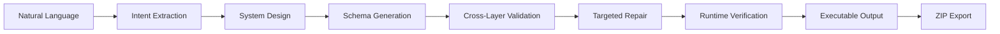

# Architecture

## Pipeline

## Components

- `server.js`: HTTP server, static asset serving, generation API, metrics API, and ZIP export.
- `src/compiler.js`: deterministic compiler pipeline for intent, assumptions, clarifications, design, schema, validation, repair, runtime verification, and generated project files.
- `public/`: browser UI for prompt intake, previews, runtime report, assumptions, logs, and ZIP download.
- `benchmarks/`: benchmark prompts and runner.
- `docs/`: gap analysis, architecture, implementation plan, and generated benchmark report.

## Validation Strategy

Validation returns structured issue objects with:

- `id`
- `type`
- `severity`
- `layer`
- `path`
- `message`
- `expected`
- `actual`
- `repairable`

The validator checks UI, API, database, and auth consistency. It detects orphan fields, orphan endpoints, unused roles, schema mismatches, broken references, and missing mappings.

## Repair Strategy

Repairs are targeted and mutate only the affected part of the blueprint. Each repair records:

- repair id
- original issue id
- repair type
- layer
- target path
- action
- count

Examples include adding a missing API field to the schema, removing unused roles, and repairing broken UI data mappings.

## Runtime Verification

Runtime verification simulates:

- route registration
- API registration
- database schema creation
- permission checks

The result is returned as `runtimeReport` with pass/fail status and individual check details.

## Executable Output

Generated files are emitted under:

- `generated-project/frontend/`: React/Vite frontend
- `generated-project/backend/`: Express backend
- `generated-project/database/`: SQL schema and schema JSON
- `generated-project/docs/`: README, blueprint, config, and runtime report

